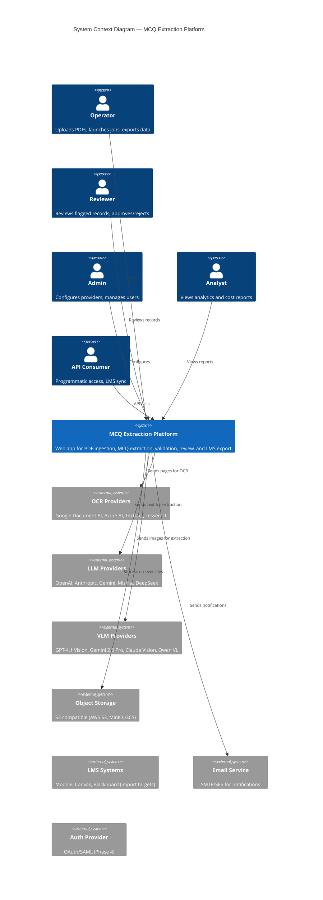
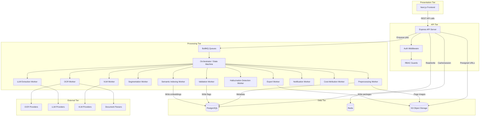
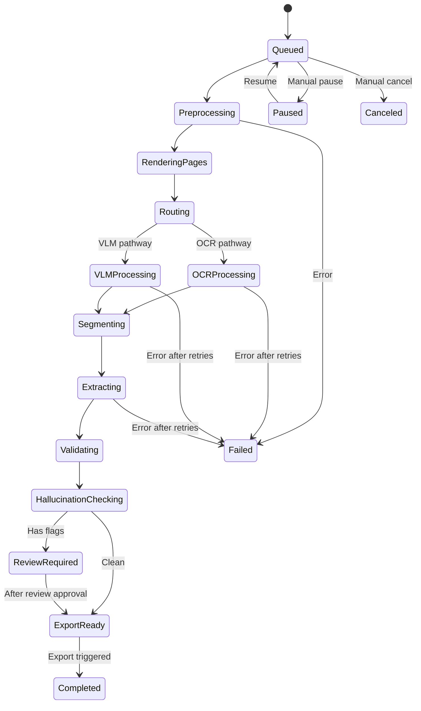
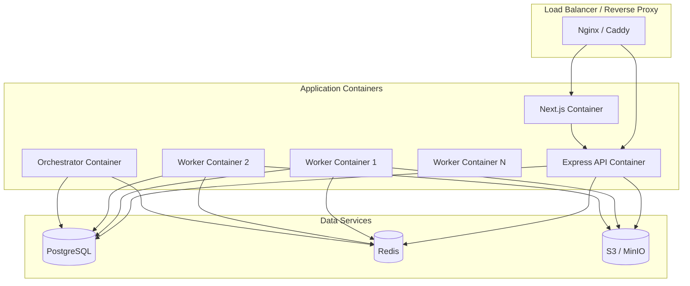

# Architecture Design — MCQ Extraction Platform v2.0

## Document Purpose

This document specifies the technical architecture for the MCQ Extraction Platform, including system context, component responsibilities, interaction models, data flows, deployment topology, resiliency, scalability, and key architectural decisions with rationale.

---

## 1. Architecture Overview

The platform follows a **queue-driven, multi-service architecture** with clear separation between:

- **Presentation tier** — Next.js App Router frontend (SSR + client-side rendering)
- **API tier** — Express REST API with auth, validation, and business orchestration
- **Processing tier** — BullMQ-based background workers with agentic coordination
- **Data tier** — PostgreSQL (relational), Redis (cache/queue), S3-compatible storage (objects)
- **External tier** — OCR, LLM, VLM, Parser, and Embedding provider APIs

The architecture is not microservices in the pure sense — it is a **modular monorepo with separate deployable apps** (web, api, worker, orchestrator) sharing code through internal packages.

---

## 2. System Context

---

## 3. Architecture Style

**Primary style:** Queue-driven service-oriented architecture within a Turborepo monorepo.

**Rationale:**
- Heavy processing (PDF parsing, OCR, LLM/VLM calls) must be async — this rules out request-response-only architectures.
- BullMQ provides reliable job queuing with retry, dead-letter, priority, and concurrency controls.
- The monorepo approach enables shared TypeScript types, schemas, and utilities across all apps while allowing independent deployment.
- Express API provides a clean boundary between frontend and business logic.
- Next.js handles SSR/SSG for authenticated pages and BFF (Backend for Frontend) patterns.

**Tradeoffs:**
- BullMQ introduces Redis as a critical dependency — Redis must be highly available.
- Shared packages create coupling between apps — version management and breaking changes require discipline.
- The Python document parsing tools require a cross-language bridge, adding operational complexity.

---

## 4. Major Components

### 4.1 Component Inventory

| Component | App/Package | Responsibility |
|-----------|-------------|----------------|
| Web Frontend | apps/web | User-facing UI: dashboards, upload, review, export, analytics |
| API Server | apps/api | REST API: auth, CRUD, job orchestration, export triggers |
| Worker Service | apps/worker | Background processing: OCR, LLM, VLM, validation, export generation |
| Orchestrator | apps/orchestrator | Agentic workflow state machine, conditional routing, agent coordination |
| Provider SDK | packages/provider-sdk | Adapter interfaces for OCR, LLM, VLM, Parser, Embedding providers |
| Extraction Core | packages/extraction-core | Core extraction business logic, prompt management |
| Validation Core | packages/validation-core | Validation rules, flagging logic, composite scoring |
| Hallucination Core | packages/hallucination-core | Tiered hallucination detection and mitigation |
| Export Core | packages/export-core | Export mapping: JSON, CSV, QTI, SCORM, xAPI, cmi5 |
| Auth Core | packages/auth-core | Auth helpers, RBAC guards, permission utilities |
| Cost Intelligence | packages/cost-intelligence | Per-operation cost tracking, attribution, budget enforcement |
| Semantic Engine | packages/semantic-engine | Embedding generation, similarity search, clustering |
| Observability | packages/observability | Structured logging, OpenTelemetry integration, correlation IDs |
| Schemas | packages/schemas | Zod schemas, JSON schemas, QTI/SCORM schemas |
| Types | packages/types | Shared TypeScript types and DTOs |
| UI Components | packages/ui | Shared shadcn/ui-based component library |

### 4.2 Component Interaction Model

---

## 5. Request and Data Flows

### 5.1 Upload Flow

1. User selects project in frontend.
2. Frontend requests presigned upload URL from API.
3. File uploads directly to S3 via presigned URL.
4. Frontend notifies API of completed upload.
5. API creates Document record in PostgreSQL.
6. API computes SHA-256 checksum, checks for duplicates.
7. API enqueues preprocessing job to BullMQ.
8. Frontend polls job status via API.

### 5.2 Extraction Pipeline Flow

### 5.3 Review Flow

1. Validation flags records with issues.
2. Review items appear in review queue, sorted by risk (highest first).
3. Reviewer opens record — sees page image, extracted JSON, source excerpt side-by-side.
4. Reviewer approves, edits, rejects, or requests reprocessing.
5. Edit creates MCQRecordHistory entry (audit trail).
6. Approved record moves to export-ready state.

### 5.4 Export Flow

1. User selects export format (JSON, QTI, SCORM, etc.) and export scope.
2. API creates ExportJob record.
3. Export worker processes approved records.
4. Worker generates export artifact (file or package) and stores in S3.
5. API returns signed download URL with expiration.

---

## 6. Sync vs Async Behavior

| Operation | Sync/Async | Rationale |
|-----------|------------|-----------|
| Auth, login, session check | Sync | Low latency, no heavy processing |
| CRUD operations (projects, documents, users) | Sync | Standard database read/write |
| Review actions (approve, reject, edit) | Sync | Single record updates |
| File upload initiation (presigned URL) | Sync | Generates URL only |
| File upload (actual bytes) | Async | Direct-to-S3 via presigned URL |
| Preprocessing | Async (BullMQ) | CPU-intensive page rendering |
| OCR processing | Async (BullMQ) | External API calls, variable latency |
| VLM extraction | Async (BullMQ) | External API calls, high latency |
| LLM extraction | Async (BullMQ) | External API calls, variable latency |
| Validation | Async (BullMQ) | May involve embedding computation |
| Hallucination detection | Async (BullMQ) | May involve multi-provider comparison |
| Export generation | Async (BullMQ) | File generation can be slow for large datasets |
| Notification delivery | Async (BullMQ) | Non-blocking |
| Cost attribution | Async (BullMQ) | Aggregation after pipeline completion |
| Semantic indexing | Async (BullMQ) | Embedding computation |
| Analytics queries | Sync | Pre-aggregated or indexed queries |

---

## 7. Deployment Architecture

**Deployment assumptions:**
- All services are containerized (Docker).
- Development uses Docker Compose with all services.
- Production uses Docker Compose, K8s, or ECS depending on scale needs.
- Worker containers are horizontally scalable (run N instances).
- PostgreSQL and Redis may be managed services in production (RDS, ElastiCache).
- S3 is the primary object storage; MinIO used for local development.

---

## 8. Resiliency Considerations

| Concern | Strategy |
|---------|----------|
| Worker failures | BullMQ auto-retry with exponential backoff; dead-letter queue for non-recoverable errors |
| Provider API failures | Circuit breaker pattern (per provider); fallback to alternate provider |
| Provider rate limiting | Provider-specific rate limit configs; queue-level concurrency controls |
| Redis failure | Use Redis Sentinel or managed Redis with replication; BullMQ handles reconnection |
| PostgreSQL failure | Use managed PostgreSQL with read replicas and automated failover |
| S3 failure | S3-compatible storage provides built-in durability; retry uploads |
| Job stalls | BullMQ stall detection with configurable timeouts |
| Partial pipeline completion | Resumable jobs — track progress at page/chunk level, restart from last checkpoint |
| Network partitions | Idempotent task design — safe to replay tasks |

---

## 9. Scalability Considerations

| Dimension | Approach |
|-----------|----------|
| Concurrent users | Horizontal web/API container scaling behind load balancer |
| Job throughput | Horizontal worker container scaling; each worker processes from shared BullMQ queues |
| Database load | PostgreSQL connection pooling (PgBouncer); read replicas for analytics queries |
| Storage volume | S3/MinIO has virtually unlimited capacity; implement lifecycle policies for cost management |
| Queue depth | Redis memory sizing; monitor queue depth; implement backpressure controls |
| Provider throughput | Per-provider concurrency limits; rate limit queuing; multi-provider parallelism |
| Search volume | pg_trgm + GIN indexes for text search; pgvector for embedding search; consider read replicas |
| Export size | Streaming export generation; chunked file writing; partial export resume |

**Scaling boundaries to plan for early:**
- Maximum concurrent BullMQ workers per queue.
- Maximum PostgreSQL connection pool size.
- Redis maxmemory setting and eviction policy.
- S3 request rate limits per prefix.

---

## 10. Observability Considerations

- **Structured JSON logging** with correlation IDs tracing a request/job from API entry through worker pipeline to completion.
- **OpenTelemetry traces** for distributed tracing across API → queue → worker → provider.
- **BullMQ dashboard** (bull-board or Taskforce.sh) for queue health monitoring.
- **Health check endpoints** for each service (API, workers, orchestrator) — used by container orchestrator for liveness/readiness probes.
- **Metrics emission** for Prometheus/Grafana or equivalent: queue lengths, worker throughput, provider latency, error rates.
- **Alerting** on: provider auth failures, queue backlog spikes, worker crash loops, hallucination rate spikes, cost anomalies.

---

## 11. Security Architecture Considerations

- **Authentication** — NextAuth/Auth.js with JWT or session strategy. API tokens for programmatic access.
- **Authorization** — RBAC with workspace-scoped permissions. Every API endpoint checks role and resource ownership.
- **Secrets** — Provider API keys encrypted at rest (AES-256 or KMS). Never logged or exposed in API responses.
- **Transport** — TLS everywhere (Nginx terminates TLS, internal traffic may be unencrypted within private network).
- **Object storage** — Workspace-prefixed paths; presigned URLs with TTL for access.
- **Input validation** — Zod schemas at every API boundary. MIME type and file size validation on upload.
- **HTTP security** — Helmet.js for headers (CSP, HSTS, X-Frame-Options). CSRF protection. Rate limiting on auth endpoints.
- **Audit** — AuditLog entity for all critical actions (admin changes, review decisions, exports).

---

## 12. Key Architecture Decisions

### AD-001: Queue-driven async processing for all heavy workloads

**Decision:** All PDF processing, OCR, LLM/VLM extraction, validation, hallucination detection, and export generation run in BullMQ background workers.

**Rationale:** These operations involve external API calls with variable latency (1–60+ seconds), CPU-intensive page rendering, and potential for provider failures requiring retry. Running them synchronously would block the web server and degrade UX.

**Tradeoff:** Adds complexity (queue management, retry logic, dead-letter queues) and introduces Redis as a critical dependency.

**Source:** Sections 3.3, 5 (Principle 4), 24.1

### AD-002: Provider abstraction via adapter interface

**Decision:** All external providers (OCR, LLM, VLM, Parser, Embedding) implement a common `ProviderAdapter` interface.

**Rationale:** Enables provider swapping, fallback chains, A/B testing, and cost comparison without pipeline changes. Isolates provider-specific logic from core business logic.

**Source:** Section 28.2

### AD-003: Turborepo monorepo with shared packages

**Decision:** Use a Turborepo monorepo with apps (web, api, worker, orchestrator) and shared packages (schemas, types, provider-sdk, etc.).

**Rationale:** Maximizes code reuse (shared Zod schemas, TypeScript types, validation rules). Enables atomic changes across frontend and backend. Reduces type mismatches.

**Tradeoff:** Requires disciplined package boundaries. Build times increase as monorepo grows.

**Source:** Section 9

### AD-004: PostgreSQL as primary data store with pg_trgm and pgvector

**Decision:** Use PostgreSQL for all relational data, with pg_trgm for fuzzy text search and pgvector for semantic embedding search.

**Rationale:** Avoids introducing a separate search engine (Elasticsearch) or graph database for MVP. PostgreSQL extensions provide sufficient capability. Neo4j remains optional for Phase 4+.

**Tradeoff:** pgvector may not scale to millions of embeddings as well as a dedicated vector database. Evaluate at Phase 3.

**Source:** Sections 8.3, 8.7

### AD-005: Drizzle ORM for database access

**Decision:** Use Drizzle ORM (preferred over Prisma) for PostgreSQL access.

**Rationale:** Drizzle provides better SQL control, TypeScript type inference from schema definitions, and more predictable query generation than Prisma. Better suited for complex queries needed by analytics and reporting.

**Ambiguity:** The planning document says "Drizzle ORM (preferred) or Prisma" — this should be finalized as Drizzle before Phase 0.

**Source:** Section 8.2

### AD-006: Python bridge for document parsing

**Decision (inferred):** PyMuPDF, PaddleOCR, and other Python-based tools require a cross-language bridge since the backend is Node.js.

**Recommended approach:** Deploy a lightweight Python FastAPI microservice as a sidecar container that handles document parsing. The Node.js worker calls this service via HTTP. Alternative: use child_process to spawn Python scripts.

**Rationale:** A sidecar microservice is more reliable than subprocess spawning, supports health checks, and scales independently.

**Source Basis:** Sections 8.2 (Node.js backend), 8.6 (Python parsing tools)
**Inference:** The planning document does not address this gap explicitly.
**Confidence:** High that a bridge is needed. Medium confidence on the specific approach.
**Impact:** Critical — must be resolved in Phase 0.

### AD-007: BFF pattern via Next.js API routes or API Gateway

**Decision (inferred):** The Next.js frontend acts as a BFF (Backend for Frontend), potentially proxying some calls to the Express API and handling auth session management.

**Source Basis:** Section 7 architecture diagram shows "API Gateway / BFF Layer in Next.js or Nginx"
**Inference:** The document is unclear on whether Next.js API routes serve as a BFF or if all calls go directly to Express.
**Confidence:** Medium
**Impact:** Medium — affects auth flow, CORS configuration, and deployment topology.

**Recommendation:** Use Next.js server actions and API routes for auth-related flows (session management, CSRF). Route all other API calls from the browser directly to the Express API via an Nginx reverse proxy that handles CORS and routing.

---

## 13. Architecture Risks

| Risk | Severity | Mitigation |
|------|----------|------------|
| Redis is a single point of failure for all job processing | High | Use Redis Sentinel or managed Redis with replication |
| Python sidecar adds operational complexity | Medium | Container health checks; fallback to Tesseract.js if Python service is unavailable |
| BullMQ queue memory growth under load | Medium | Set `removeOnComplete: true`, monitor Redis memory, implement backpressure |
| Multi-tenant data leaks via query bugs | High | Enforce workspace_id filtering at ORM middleware level; add integration tests |
| Provider API cost explosion | Medium | Budget guardrails, cost projection in preprocessing, configurable limits |
| Orchestrator complexity for agentic workflows | Medium | Defer orchestrator complexity to Phase 4; use simple sequential pipeline for MVP |
| Next.js/Express dual-server deployment complexity | Low | Clear separation of concerns; Nginx routes to correct service |
