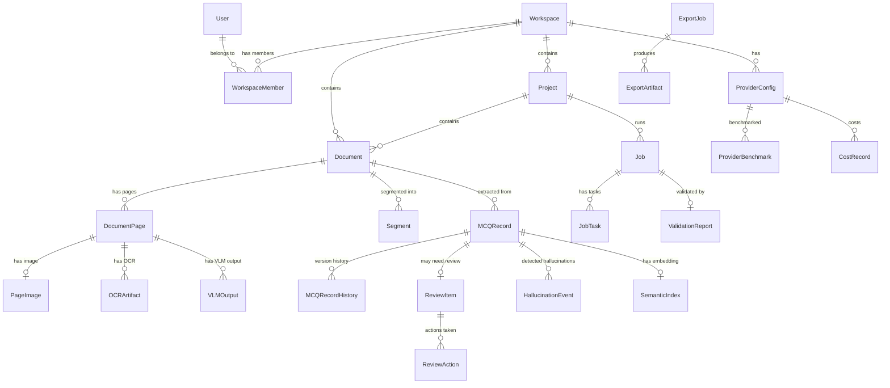

# Database Design — MCQ Extraction Platform v2.0

## Document Purpose

This document specifies the data model, entity relationships, schema outlines, indexing strategy, storage considerations, and data lifecycle management for the MCQ Extraction Platform.

---

## 1. Data Domain Overview

The platform manages data across several domains:

| Domain | Description | Volume Expectation |
|--------|-------------|-------------------|
| Identity & Access | Users, workspaces, roles, sessions | Low (thousands) |
| Project & Document | Projects, documents, pages, metadata | Medium (tens of thousands of documents) |
| Pipeline & Jobs | Jobs, tasks, workflow states | Medium (thousands of jobs, millions of tasks over time) |
| Extraction | MCQ records, segments, OCR/VLM artifacts | High (millions of records over time) |
| Review | Review items, actions, edit history | High (proportional to extraction volume) |
| Provider | Provider configs, benchmarks, cost records | Low-Medium |
| Export | Export jobs, artifacts | Low-Medium |
| Analytics | Usage metrics, hallucination events | High (append-only) |
| Semantic | Embeddings, similarity indexes | High (proportional to extraction volume) |
| System | Audit logs, notifications, prompt versions | Medium |

---

## 2. Core Entities

### 2.1 Entity List with Suggested Fields

#### User
| Field | Type | Notes |
|-------|------|-------|
| id | UUID | Primary key |
| email | VARCHAR(255) | Unique, indexed |
| name | VARCHAR(255) | |
| password_hash | VARCHAR(255) | Nullable (SSO users) |
| role | ENUM | super_admin, workspace_admin, operator, reviewer, analyst, api_user |
| status | ENUM | active, invited, disabled |
| created_at | TIMESTAMP | |
| updated_at | TIMESTAMP | |

#### Workspace
| Field | Type | Notes |
|-------|------|-------|
| id | UUID | Primary key |
| name | VARCHAR(255) | |
| slug | VARCHAR(100) | Unique, URL-safe |
| settings | JSONB | Retention, limits, defaults |
| created_at | TIMESTAMP | |
| updated_at | TIMESTAMP | |

#### WorkspaceMember
| Field | Type | Notes |
|-------|------|-------|
| id | UUID | Primary key |
| workspace_id | UUID | FK → Workspace |
| user_id | UUID | FK → User |
| role | ENUM | workspace-level role override |
| joined_at | TIMESTAMP | |

#### Project
| Field | Type | Notes |
|-------|------|-------|
| id | UUID | Primary key |
| workspace_id | UUID | FK → Workspace |
| name | VARCHAR(255) | |
| description | TEXT | Nullable |
| extraction_profile | JSONB | Provider IDs, routing mode, thresholds |
| quality_thresholds | JSONB | Confidence weights, review conditions |
| tags | TEXT[] | Array of labels |
| status | ENUM | active, archived |
| created_at | TIMESTAMP | |
| updated_at | TIMESTAMP | |

#### ProviderConfig
| Field | Type | Notes |
|-------|------|-------|
| id | UUID | Primary key |
| workspace_id | UUID | FK → Workspace |
| name | VARCHAR(255) | |
| category | ENUM | ocr, document_ai, llm, vlm, parser, embedding |
| provider_type | VARCHAR(100) | openai, anthropic, google_docai, etc. |
| api_key_encrypted | BYTEA | AES-256 encrypted |
| api_key_preview | VARCHAR(20) | Masked preview (e.g., sk-...xxxx) |
| models | TEXT[] | Available models |
| config | JSONB | Temperature, max_tokens, resolution, etc. |
| is_default | BOOLEAN | |
| health_status | ENUM | healthy, degraded, down, unknown |
| health_checked_at | TIMESTAMP | |
| created_at | TIMESTAMP | |
| updated_at | TIMESTAMP | |

#### ProviderBenchmark
| Field | Type | Notes |
|-------|------|-------|
| id | UUID | Primary key |
| provider_config_id | UUID | FK → ProviderConfig |
| metric_type | VARCHAR(50) | accuracy, latency, cost, hallucination_rate |
| metric_value | DECIMAL | |
| sample_size | INTEGER | |
| period_start | TIMESTAMP | |
| period_end | TIMESTAMP | |
| created_at | TIMESTAMP | |

#### Document
| Field | Type | Notes |
|-------|------|-------|
| id | UUID | Primary key |
| workspace_id | UUID | FK → Workspace |
| project_id | UUID | FK → Project |
| upload_session_id | UUID | FK → UploadSession |
| filename | VARCHAR(500) | Original filename |
| s3_key | VARCHAR(1000) | Object storage path |
| file_size | BIGINT | Bytes |
| mime_type | VARCHAR(100) | |
| checksum_sha256 | VARCHAR(64) | Dedup key |
| page_count | INTEGER | Nullable until preprocessed |
| has_text_layer | BOOLEAN | Nullable until preprocessed |
| status | ENUM | uploaded, preprocessing, ready, processing, completed, failed |
| tags | TEXT[] | |
| notes | TEXT | |
| metadata | JSONB | Language, classification, etc. |
| created_at | TIMESTAMP | |
| updated_at | TIMESTAMP | |

#### DocumentPage
| Field | Type | Notes |
|-------|------|-------|
| id | UUID | Primary key |
| document_id | UUID | FK → Document |
| page_number | INTEGER | 1-based |
| has_text_layer | BOOLEAN | |
| page_type | ENUM | question, answer_key, explanation, cover, index, irrelevant, unknown |
| classification | ENUM | text, scanned, mixed |
| visual_complexity_score | DECIMAL | 0–1 scale |
| language | VARCHAR(10) | ISO 639-1 |
| ocr_needed | BOOLEAN | |
| routing_decision | ENUM | ocr_llm, vlm_direct, skip |
| created_at | TIMESTAMP | |

#### PageImage
| Field | Type | Notes |
|-------|------|-------|
| id | UUID | Primary key |
| document_page_id | UUID | FK → DocumentPage |
| s3_key | VARCHAR(1000) | |
| dpi | INTEGER | |
| width | INTEGER | Pixels |
| height | INTEGER | Pixels |
| format | VARCHAR(10) | png, jpg, webp |
| created_at | TIMESTAMP | |

#### Job
| Field | Type | Notes |
|-------|------|-------|
| id | UUID | Primary key |
| workspace_id | UUID | FK → Workspace |
| project_id | UUID | FK → Project |
| status | ENUM | queued, preprocessing, rendering_pages, routing, awaiting_ocr, ocr_processing, awaiting_vlm, vlm_processing, segmenting, extracting, validating, hallucination_checking, review_required, export_ready, completed, failed, paused, canceled |
| total_documents | INTEGER | |
| total_pages | INTEGER | Nullable until preprocessing |
| total_tasks | INTEGER | |
| completed_tasks | INTEGER | |
| failed_tasks | INTEGER | |
| extraction_profile | JSONB | Snapshot of profile at job creation |
| error_summary | TEXT | Nullable |
| started_at | TIMESTAMP | |
| completed_at | TIMESTAMP | Nullable |
| created_at | TIMESTAMP | |
| updated_at | TIMESTAMP | |

#### JobTask
| Field | Type | Notes |
|-------|------|-------|
| id | UUID | Primary key |
| job_id | UUID | FK → Job |
| task_type | ENUM | preprocess, render, ocr, vlm, segment, extract, validate, hallucination_check |
| status | ENUM | queued, processing, completed, failed, dead_letter |
| input_ref | JSONB | Reference to input data (page IDs, etc.) |
| output_ref | JSONB | Reference to output data |
| provider_used | VARCHAR(100) | |
| model_used | VARCHAR(100) | |
| latency_ms | INTEGER | |
| token_usage | JSONB | input_tokens, output_tokens |
| cost_usd | DECIMAL | |
| error_message | TEXT | |
| retry_count | INTEGER | Default 0 |
| created_at | TIMESTAMP | |
| completed_at | TIMESTAMP | |

#### OCRArtifact
| Field | Type | Notes |
|-------|------|-------|
| id | UUID | Primary key |
| document_page_id | UUID | FK → DocumentPage |
| provider_config_id | UUID | FK → ProviderConfig |
| raw_text | TEXT | |
| markdown_text | TEXT | Normalized markdown |
| confidence | DECIMAL | 0–1 |
| bounding_boxes | JSONB | Layout metadata |
| s3_artifact_key | VARCHAR(1000) | Full OCR response |
| created_at | TIMESTAMP | |

#### VLMOutput
| Field | Type | Notes |
|-------|------|-------|
| id | UUID | Primary key |
| document_page_id | UUID | FK → DocumentPage |
| provider_config_id | UUID | FK → ProviderConfig |
| raw_output | JSONB | Full VLM response |
| extracted_mcqs | JSONB | Parsed MCQ candidates |
| confidence | DECIMAL | |
| token_usage | JSONB | |
| cost_usd | DECIMAL | |
| created_at | TIMESTAMP | |

#### Segment
| Field | Type | Notes |
|-------|------|-------|
| id | UUID | Primary key |
| document_id | UUID | FK → Document |
| start_page | INTEGER | |
| end_page | INTEGER | |
| raw_text | TEXT | |
| segment_type | ENUM | question, answer_key, explanation, mixed |
| question_number_detected | VARCHAR(50) | |
| created_at | TIMESTAMP | |

#### MCQRecord
| Field | Type | Notes |
|-------|------|-------|
| id | UUID | Primary key |
| workspace_id | UUID | FK → Workspace (denormalized for query perf) |
| project_id | UUID | FK → Project |
| document_id | UUID | FK → Document |
| job_id | UUID | FK → Job |
| source_pdf | VARCHAR(500) | |
| source_page | INTEGER | |
| source_page_end | INTEGER | Nullable |
| source_page_image_ref | VARCHAR(1000) | |
| question_number | VARCHAR(50) | |
| question_text | TEXT | |
| options | JSONB | Array of {label, text} |
| correct_answer | VARCHAR(10) | Nullable |
| explanation | TEXT | Nullable |
| question_type | ENUM | single_choice, multiple_choice, true_false |
| subject | VARCHAR(255) | Nullable |
| topic | VARCHAR(255) | Nullable |
| difficulty | VARCHAR(50) | Nullable |
| language | VARCHAR(10) | |
| source_excerpt | TEXT | |
| extraction_pathway | ENUM | ocr_llm, vlm_direct, hybrid |
| extraction_method | VARCHAR(100) | |
| provider_used | VARCHAR(100) | |
| model_used | VARCHAR(100) | |
| prompt_version_id | UUID | FK → PromptVersion, nullable |
| confidence | DECIMAL | 0–100 composite |
| confidence_breakdown | JSONB | ocr, segmentation, extraction, validation |
| flags | TEXT[] | Array of flag codes |
| hallucination_risk_tier | ENUM | low, medium, high |
| review_status | ENUM | unreviewed, in_review, approved, edited, rejected, reprocess_requested |
| cost_attribution | JSONB | {ocr_cost_usd, llm_cost_usd, vlm_cost_usd, total_cost_usd} |
| schema_version | VARCHAR(20) | |
| version | INTEGER | For optimistic locking |
| created_at | TIMESTAMP | |
| updated_at | TIMESTAMP | |

#### MCQRecordHistory
| Field | Type | Notes |
|-------|------|-------|
| id | UUID | Primary key |
| mcq_record_id | UUID | FK → MCQRecord |
| version | INTEGER | |
| previous_values | JSONB | Snapshot of changed fields before edit |
| changed_by | UUID | FK → User |
| change_reason | TEXT | Reviewer notes |
| created_at | TIMESTAMP | |

#### ReviewItem
| Field | Type | Notes |
|-------|------|-------|
| id | UUID | Primary key |
| workspace_id | UUID | FK → Workspace |
| mcq_record_id | UUID | FK → MCQRecord |
| severity | ENUM | critical, high, medium, low |
| flag_types | TEXT[] | |
| reason_summary | TEXT | |
| assigned_to | UUID | FK → User, nullable |
| status | ENUM | unreviewed, in_review, resolved |
| created_at | TIMESTAMP | |
| assigned_at | TIMESTAMP | |
| resolved_at | TIMESTAMP | |

#### ReviewAction
| Field | Type | Notes |
|-------|------|-------|
| id | UUID | Primary key |
| review_item_id | UUID | FK → ReviewItem |
| action_type | ENUM | approve, reject, edit, reprocess, assign, comment |
| performed_by | UUID | FK → User |
| notes | TEXT | |
| changes | JSONB | For edit actions |
| created_at | TIMESTAMP | |

#### ExportJob
| Field | Type | Notes |
|-------|------|-------|
| id | UUID | Primary key |
| workspace_id | UUID | FK → Workspace |
| project_id | UUID | FK → Project |
| format | ENUM | json, jsonl, csv, qti_2_1, qti_3_0, scorm_1_2, scorm_2004, xapi, cmi5 |
| scope | JSONB | Filters, document IDs, tag filters |
| status | ENUM | queued, processing, completed, failed |
| total_records | INTEGER | |
| include_audit_bundle | BOOLEAN | |
| created_at | TIMESTAMP | |
| completed_at | TIMESTAMP | |

#### ExportArtifact
| Field | Type | Notes |
|-------|------|-------|
| id | UUID | Primary key |
| export_job_id | UUID | FK → ExportJob |
| artifact_type | ENUM | data, audit_bundle |
| s3_key | VARCHAR(1000) | |
| file_size | BIGINT | |
| download_url_expiry | TIMESTAMP | |
| created_at | TIMESTAMP | |

#### ValidationReport
| Field | Type | Notes |
|-------|------|-------|
| id | UUID | Primary key |
| job_id | UUID | FK → Job |
| total_records | INTEGER | |
| passed_count | INTEGER | |
| flagged_count | INTEGER | |
| failed_count | INTEGER | |
| duplicate_count | INTEGER | |
| weak_ocr_count | INTEGER | |
| missing_answer_count | INTEGER | |
| vlm_pathway_count | INTEGER | |
| hallucination_count | INTEGER | |
| export_ready_count | INTEGER | |
| rule_breakdown | JSONB | Per-rule counts |
| estimated_cost_usd | DECIMAL | |
| created_at | TIMESTAMP | |

#### HallucinationEvent
| Field | Type | Notes |
|-------|------|-------|
| id | UUID | Primary key |
| mcq_record_id | UUID | FK → MCQRecord |
| detection_tier | ENUM | model, context, data |
| detection_rule | VARCHAR(100) | |
| details | JSONB | |
| provider_used | VARCHAR(100) | |
| model_used | VARCHAR(100) | |
| created_at | TIMESTAMP | |

#### CostRecord
| Field | Type | Notes |
|-------|------|-------|
| id | UUID | Primary key |
| workspace_id | UUID | FK → Workspace |
| job_id | UUID | FK → Job, nullable |
| provider_config_id | UUID | FK → ProviderConfig |
| operation_type | ENUM | ocr, llm_extraction, vlm_extraction, embedding |
| cost_usd | DECIMAL | |
| token_count | INTEGER | Nullable (not all providers use tokens) |
| page_count | INTEGER | Nullable |
| created_at | TIMESTAMP | |

#### AuditLog
| Field | Type | Notes |
|-------|------|-------|
| id | UUID | Primary key |
| workspace_id | UUID | FK → Workspace, nullable (system events) |
| user_id | UUID | FK → User |
| action | VARCHAR(100) | |
| resource_type | VARCHAR(50) | |
| resource_id | UUID | |
| details | JSONB | |
| ip_address | INET | |
| created_at | TIMESTAMP | |

#### Notification
| Field | Type | Notes |
|-------|------|-------|
| id | UUID | Primary key |
| user_id | UUID | FK → User |
| workspace_id | UUID | FK → Workspace |
| type | VARCHAR(100) | |
| title | VARCHAR(500) | |
| message | TEXT | |
| data | JSONB | |
| read | BOOLEAN | Default false |
| created_at | TIMESTAMP | |

#### PromptVersion
| Field | Type | Notes |
|-------|------|-------|
| id | UUID | Primary key |
| prompt_id | VARCHAR(100) | Logical prompt identifier |
| version | INTEGER | |
| provider_family | VARCHAR(100) | openai, anthropic, etc. |
| task_type | VARCHAR(100) | mcq_extraction, segmentation, etc. |
| template | TEXT | Prompt template with placeholders |
| schema_ref | VARCHAR(100) | Expected output schema |
| is_active | BOOLEAN | |
| performance_metrics | JSONB | accuracy rate, hallucination rate |
| created_at | TIMESTAMP | |

#### SemanticIndex
| Field | Type | Notes |
|-------|------|-------|
| id | UUID | Primary key |
| mcq_record_id | UUID | FK → MCQRecord |
| embedding_vector | VECTOR(1536) | pgvector column (dimension depends on model) |
| embedding_model | VARCHAR(100) | |
| created_at | TIMESTAMP | |

---

## 3. Entity Relationship Diagram

---

## 4. Data Ownership Assumptions

| Entity | Owner | Lifecycle |
|--------|-------|-----------|
| User | System-wide | Persists until account deletion |
| Workspace | Super Admin creates | Persists until workspace deletion |
| Project | Workspace Admin creates | Persists until archived/deleted |
| Document | Operator uploads | Persists until retention policy purges |
| MCQRecord | System creates via extraction | Persists until workspace deletion or retention purge |
| ReviewItem | System creates via validation | Resolved items retained for audit |
| ExportJob | Operator/API user creates | Artifacts expire per signed URL TTL |
| CostRecord | System creates | Append-only; retained for billing/analytics |
| AuditLog | System creates | Append-only; retained per compliance requirements |

---

## 5. Transaction and Consistency Needs

| Operation | Transaction Scope | Isolation Level |
|-----------|-------------------|-----------------|
| Create MCQ records (batch) | Single transaction per batch | Read Committed |
| Review edit + history | Transaction (update record + insert history) | Read Committed |
| Job status transition | Single row update with optimistic locking | Read Committed |
| Export job creation | Create ExportJob + enqueue BullMQ job | Eventual consistency (2-phase) |
| Duplicate detection | Read-only query | Read Committed |
| Cost attribution (batch) | Bulk insert | Read Committed |

**Note:** BullMQ job enqueue and PostgreSQL writes are not in a single distributed transaction. If the DB write succeeds but BullMQ enqueue fails, implement a polling recovery worker that scans for jobs in "queued" status without a corresponding BullMQ job.

---

## 6. Indexing Strategy

### 6.1 Critical Indexes

| Table | Index | Type | Purpose |
|-------|-------|------|---------|
| MCQRecord | workspace_id, project_id | B-tree composite | Workspace-scoped queries |
| MCQRecord | review_status | B-tree | Review queue filtering |
| MCQRecord | confidence | B-tree | Confidence-based sorting |
| MCQRecord | flags | GIN | Flag-based filtering |
| MCQRecord | question_text | GIN (pg_trgm) | Full-text fuzzy search |
| MCQRecord | document_id | B-tree | Per-document queries |
| Document | workspace_id, project_id | B-tree composite | Workspace-scoped queries |
| Document | checksum_sha256 | B-tree unique | Dedup lookups |
| ReviewItem | workspace_id, status, severity | B-tree composite | Review queue queries |
| ReviewItem | assigned_to | B-tree | Reviewer workload queries |
| JobTask | job_id, status | B-tree composite | Job progress queries |
| CostRecord | workspace_id, created_at | B-tree composite | Cost analytics |
| AuditLog | workspace_id, created_at | B-tree composite | Audit log queries |
| SemanticIndex | embedding_vector | IVFFlat or HNSW (pgvector) | Similarity search |
| HallucinationEvent | provider_used, created_at | B-tree composite | Provider hallucination analytics |

### 6.2 Partial Indexes

| Table | Condition | Purpose |
|-------|-----------|---------|
| MCQRecord | WHERE review_status = 'unreviewed' | Fast review queue count |
| ReviewItem | WHERE status = 'unreviewed' | Fast unresolved count |
| Job | WHERE status NOT IN ('completed', 'canceled', 'failed') | Active job listing |

---

## 7. Archival and Retention

- **Active data:** Last 12 months (default, configurable per workspace).
- **Archived data:** Moved to cold storage or separate schema after retention period.
- **Purge policy:** Configurable per workspace. Must purge: documents, page images, MCQ records, OCR artifacts, VLM outputs, segments.
- **Exempt from purge:** AuditLog, CostRecord (retained for compliance/billing).
- **S3 lifecycle rules:** Transition old exports to S3 Glacier after 90 days. Delete after 1 year (configurable).

---

## 8. Backup and Recovery

- **PostgreSQL:** Daily automated backups (pg_dump or managed service snapshots). Point-in-time recovery (WAL archiving).
- **Redis:** AOF persistence enabled. Redis data is ephemeral (queue state can be reconstructed from DB). Backup not critical but recommended for session data.
- **S3:** S3 versioning enabled for critical prefixes (raw PDFs, exports). Cross-region replication optional.
- **Recovery targets:**
  - RPO (Recovery Point Objective): 1 hour (assumption — not defined in source).
  - RTO (Recovery Time Objective): 4 hours (assumption — not defined in source).

---

## 9. Migration Strategy

- **ORM:** Drizzle ORM with migration files in `drizzle/` directory.
- **Migration workflow:** Generate migration → review SQL → apply to staging → verify → apply to production.
- **Rollback:** Every migration must have a corresponding down migration.
- **Zero-downtime migrations:** For table alterations, use additive-only changes (add columns nullable, then backfill, then add constraints).
- **Data migrations:** Separate from schema migrations. Run as scripts with progress tracking.

---

## 10. Privacy and Data Classification

| Data Class | Examples | Handling |
|------------|----------|----------|
| PII | User email, name, IP address | Encrypted at rest; access logged; purged on account deletion |
| Secrets | Provider API keys | AES-256 encrypted; never in logs; masked in API responses |
| Content | PDF files, extracted text, MCQ records | Workspace-isolated; purged per retention policy |
| Operational | Job logs, metrics, cost records | Retained for analytics; no PII content |
| Audit | Audit log entries | Append-only; retained per compliance; immutable |

---

## 11. Reporting and Analytics Implications

Heavy analytics queries (provider comparison, cost trends, hallucination rates) should not hit the primary database under load.

**Recommended approach:**
- **Phase 1:** Acceptable to query primary database with appropriate indexes.
- **Phase 2+:** Create materialized views or summary tables that are refreshed periodically (every 5–15 minutes).
- **Phase 3+:** If analytics load grows, consider a read replica dedicated to analytics queries.

Summary tables to pre-compute:
- Daily job statistics per workspace
- Daily cost breakdown per provider per workspace
- Weekly hallucination rates per provider
- Review queue aging metrics
