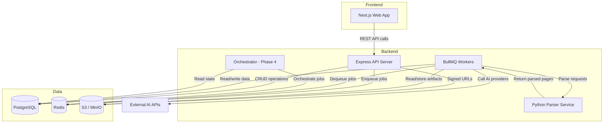

# Integration & Dependencies — MCQ Extraction Platform v2.0

## Document Purpose

This document catalogs all internal service dependencies, external integrations, third-party service dependencies, and their characteristics (protocols, auth, rate limits, failure modes, fallback strategies).

---

## 1. Internal Service Dependency Graph



---

## 2. Internal Dependencies

### 2.1 Service-to-Service Communication

| Source | Target | Protocol | Purpose | Failure Impact |
|--------|--------|----------|---------|---------------|
| Web → API | HTTP/REST | All data operations | Frontend unusable |
| API → PostgreSQL | TCP (pg wire) | Data persistence | All writes fail; reads fail |
| API → Redis | TCP (RESP) | Session storage, rate limiting, job enqueueing | Sessions lost; no new jobs |
| API → S3 | HTTPS | Generate signed URLs | No file upload/download |
| Worker → Redis | TCP (RESP) | Job dequeuing | Workers idle |
| Worker → PostgreSQL | TCP (pg wire) | Read inputs, write results | Jobs fail |
| Worker → S3 | HTTPS | Read PDFs, store artifacts | Jobs fail |
| Worker → Parser | HTTP/REST | Document page extraction | Parsing jobs fail |
| Worker → External AI | HTTPS | OCR, LLM, VLM API calls | Extraction jobs fail |

### 2.2 Shared Package Dependencies (Internal)

| Package | Depended On By | Purpose |
|---------|---------------|---------|
| packages/shared-types | All apps + packages | TypeScript type definitions |
| packages/db | API, Worker, Orchestrator | Drizzle schema, migrations, query builders |
| packages/queue | API, Worker, Orchestrator | BullMQ queue definitions, job types |
| packages/logger | All apps + packages | Structured JSON logging |
| packages/config | All apps + packages | Environment-aware configuration |
| packages/validators | API, Worker | Zod validation schemas |
| packages/provider-adapters | Worker | AI provider adapter implementations |
| packages/confidence | Worker | Composite confidence scoring |
| packages/hallucination | Worker | Hallucination detection engine |
| packages/export-engine | Worker | LMS format generators |
| packages/storage | API, Worker | S3 client wrapper |
| packages/auth | API | Auth + RBAC middleware |
| packages/cost-intelligence | API, Worker | Cost tracking and budget rules |
| packages/test-fixtures | All apps (devDependency) | Test data factories and mocks |

---

## 3. External AI Provider Integrations

### 3.1 OCR Providers

| Provider | Protocol | Auth | Rate Limit | Timeout | Retry Strategy | Phase |
|----------|----------|------|-----------|---------|---------------|-------|
| Google Cloud Vision | HTTPS REST | API Key or OAuth2 Service Account | 1800 req/min | 30s | 3 retries, exponential backoff | P1 |
| AWS Textract | HTTPS REST (AWS SDK) | IAM (Access Key + Secret) | Varies by region | 60s | 3 retries, exponential backoff | P1 |
| Azure AI Document Intelligence | HTTPS REST | API Key (subscription key) | 15 req/sec | 60s | 3 retries, exponential backoff | P2 |
| PaddleOCR | Local Python library | N/A (local) | N/A | 30s | 2 retries | P1 |
| Tesseract | Local binary | N/A (local) | N/A | 30s | 2 retries | P1 |

### 3.2 LLM Providers

| Provider | Protocol | Auth | Rate Limit | Timeout | Retry Strategy | Phase |
|----------|----------|------|-----------|---------|---------------|-------|
| OpenAI (GPT-4/4o) | HTTPS REST | Bearer token (API Key) | Varies by tier (TPM/RPM) | 120s | 3 retries, exponential backoff (respect 429 Retry-After) | P1 |
| Anthropic (Claude) | HTTPS REST | x-api-key header | Varies by tier | 120s | 3 retries, exponential backoff | P1 |
| Google Gemini | HTTPS REST | API Key or OAuth2 | Varies by model | 120s | 3 retries, exponential backoff | P2 |
| Mistral | HTTPS REST | Bearer token | Varies | 120s | 3 retries, exponential backoff | P2 |
| Groq | HTTPS REST | Bearer token | Varies | 60s | 3 retries, exponential backoff | P2 |
| Local LLM (Ollama) | HTTP REST (local) | None | N/A | 300s | 2 retries | P3 |

### 3.3 VLM Providers

| Provider | Protocol | Auth | Rate Limit | Timeout | Retry Strategy | Phase |
|----------|----------|------|-----------|---------|---------------|-------|
| OpenAI GPT-4V / 4o | HTTPS REST | Bearer token | Varies by tier | 120s | 3 retries, exponential backoff | P2 |
| Anthropic Claude Vision | HTTPS REST | x-api-key header | Varies by tier | 120s | 3 retries, exponential backoff | P2 |
| Google Gemini Pro Vision | HTTPS REST | API Key / OAuth2 | Varies | 120s | 3 retries, exponential backoff | P2 |

### 3.4 Document Parsing Providers

| Provider | Protocol | Auth | Rate Limit | Timeout | Phase |
|----------|----------|------|-----------|---------|-------|
| PyMuPDF (local) | Python library (via Parser service) | N/A | N/A | 30s | P0 |
| LlamaParse | HTTPS REST | API Key | Varies | 120s | P2 |
| Apache Tika | HTTP REST (local) | N/A | N/A | 60s | P2 |
| Unstructured.io | HTTPS REST | API Key | Varies | 120s | P3 |

### 3.5 Embedding Providers (Phase 3+)

| Provider | Protocol | Auth | Rate Limit | Timeout | Phase |
|----------|----------|------|-----------|---------|-------|
| OpenAI Embeddings | HTTPS REST | Bearer token | Varies | 30s | P3 |
| Cohere Embed | HTTPS REST | Bearer token | Varies | 30s | P3 |
| Local (sentence-transformers) | Python library | N/A | N/A | 10s | P3 |

---

## 4. Infrastructure Dependencies

| Dependency | Required By | Version | Criticality | Failure Mode |
|-----------|-------------|---------|-------------|-------------|
| PostgreSQL | API, Worker, Orchestrator | 16+ | Critical | All persistence fails |
| Redis | API, Worker, Orchestrator | 7+ | Critical | Sessions, queues, rate limiting fail |
| S3 / MinIO | API, Worker | S3 API compatible | Critical | File storage/retrieval fails |
| Node.js | Web, API, Worker | 20 LTS | Critical | All JS services fail |
| Python | Parser service | 3.12+ | High | Document parsing fails |
| Docker | All services | 24+ | High | Deployment fails |
| Turborepo | Build pipeline | Latest | Medium | Build orchestration fails (fallback: serial builds) |

---

## 5. External Service Dependencies

| Service | Purpose | Criticality | Fallback |
|---------|---------|-------------|----------|
| Email service (SendGrid/SES/SMTP) | User invitations, password reset, notifications | Medium | Queue emails; retry later |
| DNS provider | Domain resolution | Critical | Redundant DNS; long TTL caching |
| TLS certificate provider | HTTPS encryption | Critical | Auto-renewal (Let's Encrypt / cloud managed) |
| Container registry | Docker image storage | High | Cache images locally; multi-registry |
| CI/CD platform (GitHub Actions) | Build and deploy automation | High | Manual deploy from local |
| NPM registry | Package installation | Medium | Offline cache; lock file ensures reproducibility |
| ClamAV | Virus scanning of uploads | Medium | Skip scan with warning (degrade gracefully) |

---

## 6. Provider Adapter Interface Contract

All AI provider integrations implement a common adapter interface:

```typescript
interface ProviderAdapter {
  readonly providerId: string;
  readonly category: 'ocr' | 'llm' | 'vlm' | 'parser' | 'embedding';

  // Capability check
  isAvailable(): Promise<boolean>;
  testConnection(): Promise<TestResult>;

  // Execution
  execute(input: ProviderInput): Promise<ProviderOutput>;

  // Cost estimation
  estimateCost(input: ProviderInput): CostEstimate;
}
```

| Method | Purpose | Timeout | Retry |
|--------|---------|---------|-------|
| isAvailable() | Health check | 5s | None |
| testConnection() | Validate credentials + model access | 10s | None |
| execute() | Run the actual AI operation | Provider-specific (30–300s) | Per config |
| estimateCost() | Pre-execution cost estimate | Synchronous | N/A |

---

## 7. Dependency Risk Matrix

| Risk | Affected Dependencies | Likelihood | Impact | Mitigation |
|------|----------------------|------------|--------|------------|
| Provider API breaking change | All external AI providers | Medium | High | Pin SDK versions; adapter versioning; integration tests |
| Provider rate limit hit | OpenAI, Anthropic, Google | High | Medium | Per-provider rate limiting in adapter; queue backpressure |
| Provider outage (> 1 hour) | Any single AI provider | Medium | Medium | Multi-provider support; automatic failover |
| PostgreSQL outage | All services | Low | Critical | Managed DB with failover; point-in-time recovery |
| Redis outage | Session, queue, rate limiting | Low | Critical | Redis persistence (AOF); restart recovery |
| S3 outage | File storage/retrieval | Very low | Critical | Regional redundancy; S3's 99.999999999% durability |
| Python parser service crash | Document parsing jobs | Medium | High | Health checks; auto-restart; container liveness probe |
| NPM registry outage | CI/CD builds | Low | Medium | Offline cache; lock file |
| ClamAV service failure | File upload scanning | Medium | Low | Skip scan gracefully; flag as "unscanned" |

---

## 8. Integration Testing Strategy

| Integration | Test Approach | Mock Strategy |
|-------------|--------------|---------------|
| AI providers (OCR/LLM/VLM) | Adapter contract tests with mocked HTTP | MSW (Mock Service Worker) with recorded responses |
| PostgreSQL | Test containers (real PostgreSQL instance) | Real DB per test suite |
| Redis | Test containers (real Redis instance) | Real Redis per test suite |
| S3 / MinIO | MinIO in Docker Compose | Real MinIO instance |
| Python parser | Mock HTTP responses | MSW or direct mock of parser client |
| Email service | Captured emails (Ethereal or in-memory) | Mock SMTP server |
| ClamAV | Mock scan results | Mock ClamAV client |

---

## 9. Dependency Version Pinning Policy

| Category | Policy | Update Frequency |
|----------|--------|-----------------|
| Runtime dependencies | Exact version pinning via lock file | Monthly review; immediate for security patches |
| Development dependencies | Exact version pinning via lock file | Monthly review |
| Docker base images | Pin to specific digest or minor version | Quarterly; immediate for CVEs |
| AI provider SDKs | Pin to minor version | Per release review |
| Database (PostgreSQL) | Pin to major version | Annual review |
| Redis | Pin to major version | Annual review |

---

## 10. Dependency Inventory Gaps

| Gap | Impact | Recommendation |
|-----|--------|---------------|
| No monitoring/APM tool selected | Observability setup blocked | Decide: Datadog vs Grafana stack vs CloudWatch |
| No email service provider selected | Invitation/notification flow blocked | Decide: SendGrid vs SES vs Postmark |
| No error tracking service selected | Production error visibility lacking | Consider: Sentry, Bugsnag, or Datadog Error Tracking |
| No feature flag service selected | Feature flag management manual | Consider: LaunchDarkly, Unleash, or environment variables |
| No CDN provider selected | Static asset and image delivery suboptimal | Consider: CloudFront, Cloudflare, or Vercel Edge |
| Auth provider not finalized | Auth implementation approach uncertain | Decide: custom vs Auth0 vs Clerk vs Lucia |
